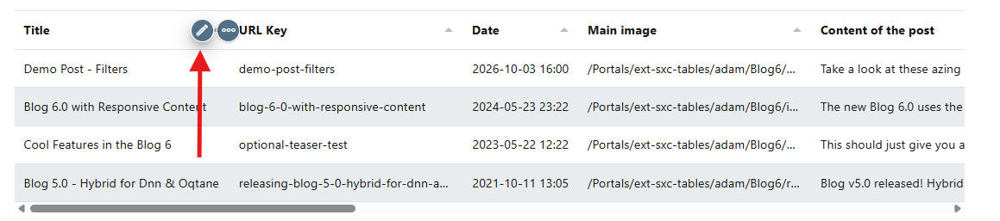

# Link and Detail Sites

Configure how users navigate between views using column links and show details.

## Enable Linking

Enable configuration mode in the toolbar and hover over the target column header and click the edit icon.

  
  

  

You're now in the column editor.

## Configure the Link

In the column settings, scroll to the link area (highlighted below):

1. Set **Link Type** to **View (select from list)**.
2. In **Linking Configuration**, choose **Reference a Specific View** (example: `Posts Filtered`).
3. Optional: Fill **Link Parameters** if you want to pass custom values.
4. Optional: Set **Link Target** (leave empty for normal navigation, use `_blank` for a new tab).

  

**Result**  
After saving, clicking values in that column opens the linked target view.

## Link Parameters

Link parameters let you open another view already filtered to the clicked row.

### Use Link Parameters

After selecting the target view, use **Link Parameters** to pass values to that view.
If you leave it empty, Radmin uses parameters expected by the linked view.

  

**Parameter Format**  
Use this pattern to pass values.
The key can be the name of the field, an ID, or a GUID:

`category=[key]`

**What This Means**  

- `category` is the parameter name that the target view expects
- `[key]` is replaced with the actual value from the clicked row

The key can be the name of the field, an ID, or a GUID.

### See It in Action

When users click the link, Radmin appends the resolved parameter to the URL.

  

**Result**  
The target view receives the parameter and can show only matching data.

Next step:

Continue with {title="Detail View"} for automatic item details.
