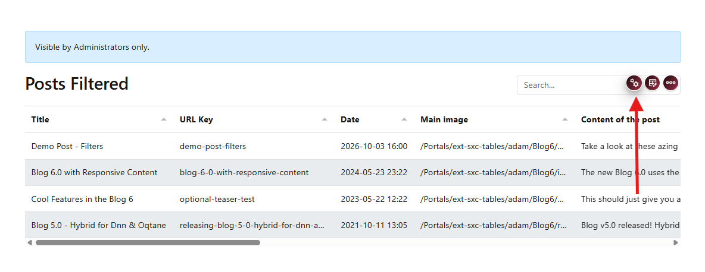
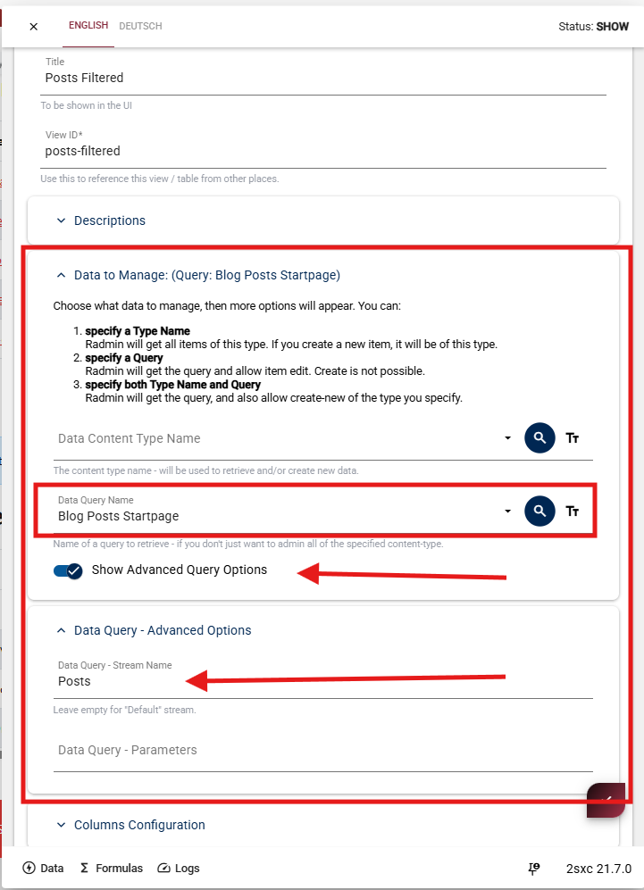
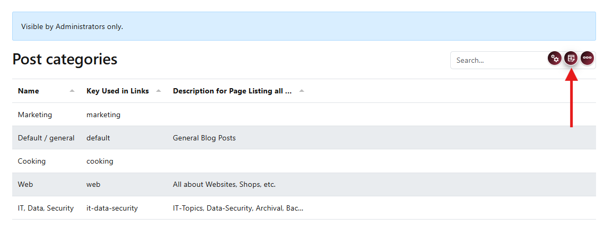
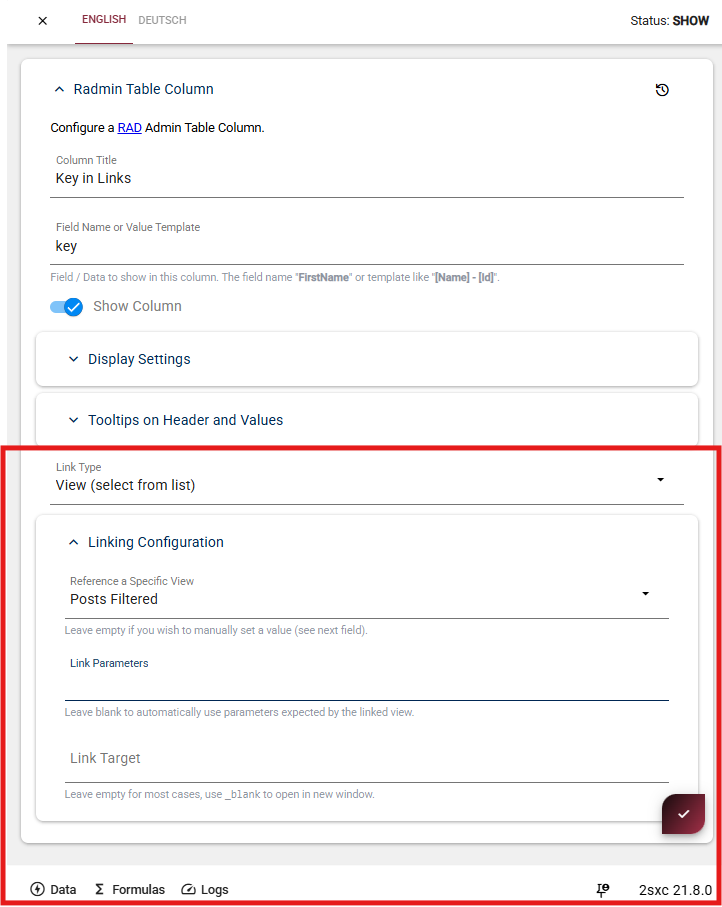

# Link and Query Configuration

Configure how your table handles data from queries and how users navigate between views using column links.

## Query Configuration

Use query mode when table data should come from a query instead of directly from a content type.

### Open Data Configuration

Open table configuration and go to **Data to Manage**.

  

You're now in the data configuration section.

### Set Query Source

Set **Data Query Name** to the query you want to use.

  

**Data Query Name**  
The query that provides your table data.

**Show Advanced Query Options**  
Enable only if your query uses a custom stream or needs URL parameters.

### Advanced Options (if needed)

If you enabled advanced options, set:

**Data Query - Stream Name**  
Use when your query returns data on a stream other than the default.

**Data Query - Parameters**  
Use when your query expects values from URL or context.

**Keep It Simple**  
Keep advanced options empty unless needed, so the setup stays easy to maintain.

### Link Column to View

You can turn a column value into a link that opens another Radmin view.

### Enable Linking

Enable configuration mode in the toolbar.

  

Hover over the target column header and click the edit icon.

  

You're now in the column editor.

### Configure the Link

In the column settings, scroll to the link area (highlighted below):

1. Set **Link Type** to **View (select from list)**.
2. In **Linking Configuration**, choose **Reference a Specific View** (example: `Posts Filtered`).
3. Optional: Fill **Link Parameters** if you want to pass custom values.
4. Optional: Set **Link Target** (leave empty for normal navigation, use `_blank` for a new tab).

  

**Result**  
After saving, clicking values in that column opens the linked target view.

### Link Parameters

Link parameters let you open another view already filtered to the clicked row.

### Use Link Parameters

After selecting the target view, use **Link Parameters** to pass values to that view.
If you leave it empty, Radmin uses parameters expected by the linked view.

  

**Parameter Format**  
Use this pattern to pass values:

`category=[key]`

**What This Means**  

- `category` is the parameter name that the target view expects
- `[key]` is replaced with the actual value from the clicked row

### See It in Action

When users click the link, Radmin appends the resolved parameter to the URL.

  

**Result**  
The target view receives the parameter and can show only matching data.

Next step:

Continue with {title="Detail View"} for automatic item details.
