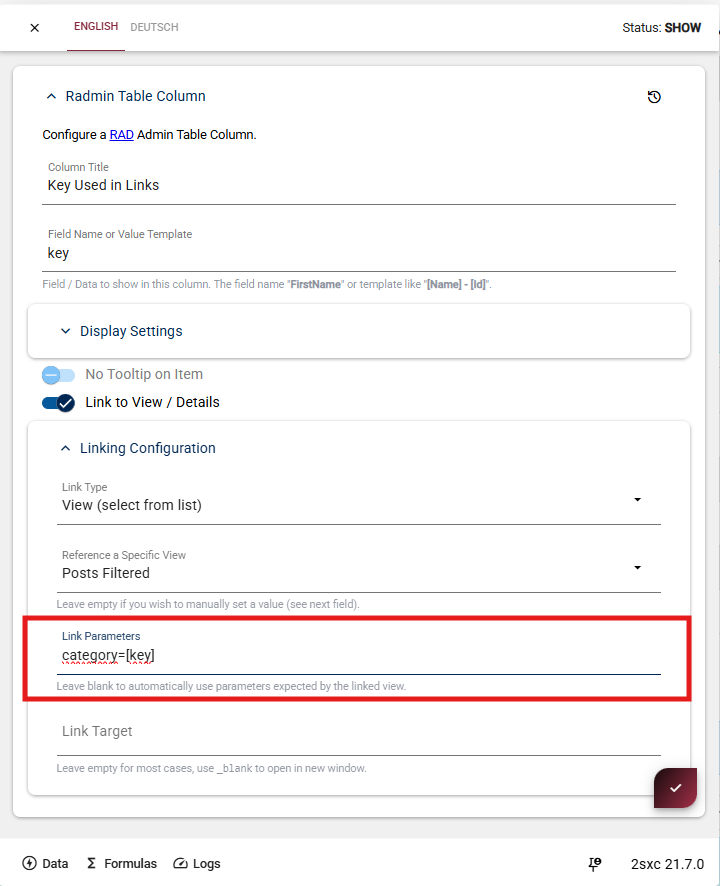
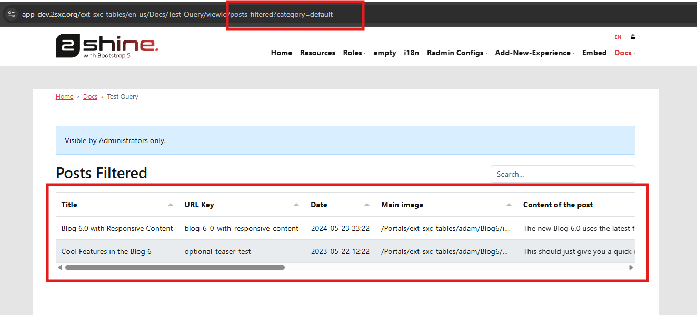

# Link Parameters

Link parameters let you open another view already filtered to the clicked row.

  
  

After enabling **Link to View / Details** and selecting a target view, use **Link Parameters**.

Example:

`category=[key]`

In this example, `category` is the parameter name and `[key]` is replaced with the clicked row value.

When users click the link, Radmin appends the resolved parameter to the URL.

The target view can then read that value and show only matching data.

