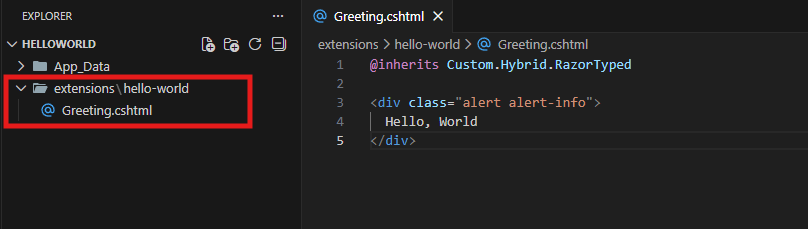
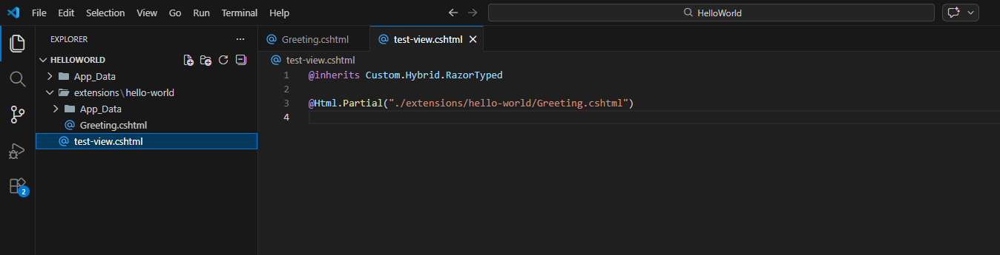
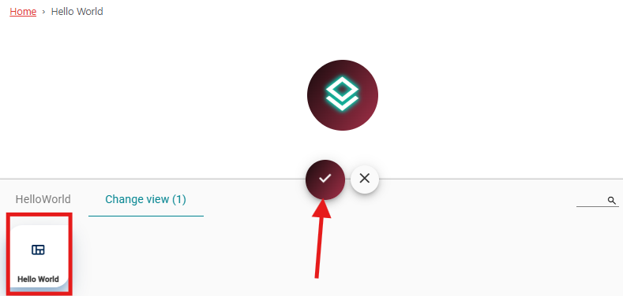
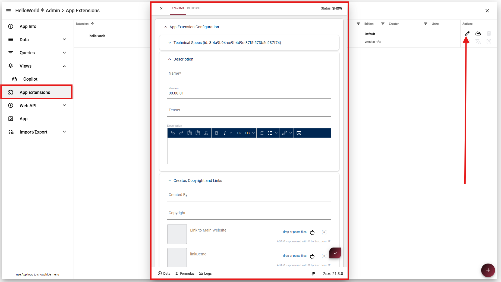
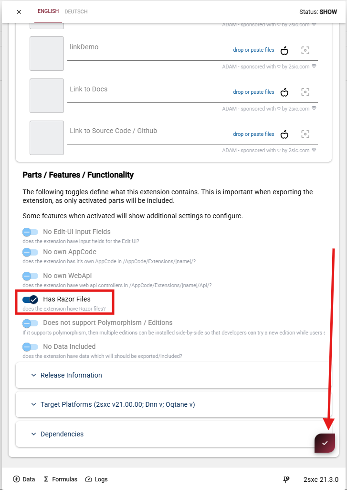
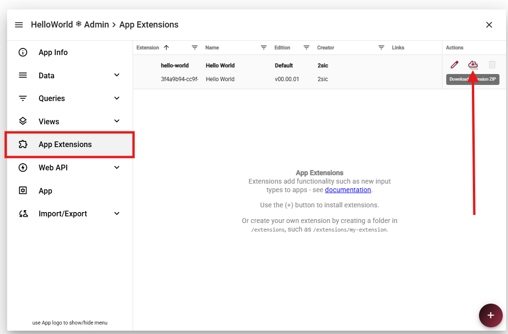
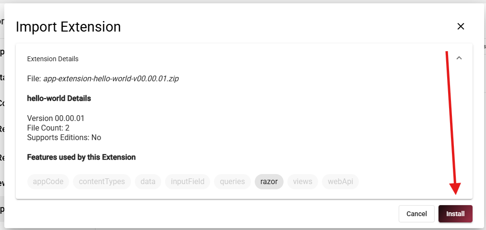

# Create Your First Hello World App Extension WIP

<!-- [!include[](~/pages/basics/stack/_shared-float-summary.md)]
<style>
  .context-box-summary .data-all,
  .context-box-summary .query-app,
  .context-box-summary .process-razor,
  .context-box-summary .process-web-api-app,
  .context-box-summary .edit-ui-custom
  { visibility: visible; }
</style> -->

In this section, we'll create a simple "Hello World" App Extension to demonstrate the basics of extension development.

## Step 1: Create the Extension Folder

In your App, create a new folder `/extensions/hello-world` and inside that,
create a `Greeting.cshtml` file with this contents:

```razor
@inherits Custom.Hybrid.RazorTyped

<div class="alert alert-info">
  Hello, World
</div>
```

The `@inherits Custom.Hybrid.RazorTyped` line allows the Razor file to use the 2sxc API.

Here’s how your extension folder and `Greeting.cshtml` should look:

<div gallery="gallery2">
  
</div>

## Step 2: Test Your Extension

### 1. Create the View File

Create a new file inside your **App directory**  
> Do **not** place it inside the `extensions` directory.

Inside this file, use `@Html.Partial(Path)` to render your extension component.

<div gallery="TestExtension">
  
</div>

---

### 2. Create a View in App Settings

After creating the file:

1. Go to **App Settings**
2. Create a **new view**
3. Give it a name
4. Link the file you just created
5. Set **“View doesn’t need Data”** if the view does not require data  
   (in this case, it does not)

<div gallery="View">
  
  
</div>

---

### 3. Add the View to a Page

Once the view is created, you can:

1. Add the App to your page
2. Select the newly created **Hello World** view

<div gallery="AddView">
  
</div>

## Step 3: Create the Extension Manifest

Go to **App Settings** and open **App Extensions**.

You will see the extension you recently created.  
Click the **edit (pen) icon** to open its configuration.

Inside the configuration, you can define various settings and metadata for your extension, including its available **Features**.

Since this extension contains a Razor component, make sure to enable/select:

- **Has Razor Files**

This ensures your Razor component is properly registered and available.

After making your changes, click **Save** to apply and store the configuration.


<div gallery="manifest">
  
  
</div>

## Step 4: Export Your Extension

To export the extension, go to **App Settings** → **App Extensions**.

Locate your extension and click the **Download icon** (cloud with arrow) to export and download the configuration.

This will generate and download the extension package to your local machine.

<div gallery="export">
  
</div>

## Step 5: Import Your Extension into Another App

To import your extension into a different App:

1. Go to **App Settings** → **App Extensions**
2. Click the **+ icon** (bottom right)
3. Select **"Select Files"**
4. Choose the extension package you previously exported
5. Click **Install**

Once the installation is complete, the extension will be available in the new App.

<div gallery="import">
  
  
</div>

---

### Add the Extension to a View

To verify that everything works:

1. Go to **Views**
2. Open the view where you want to display the extension
3. Click the **code icon** <> to open the online editor
4. Use `@Html.Partial(Path)` with the correct path to your extension component to render it inside the view

After saving the view, the extension component (e.g., your **Hello World** Razor file) should be visible on the page.

<div gallery="import">
  
  
</div>

## Step 6: Distribute the App

This is optional - and in the case of the **Hello World** not useful - but you can distribute your extension to other users via the Marketplace.
To do that, you need to create a package and submit it to the Marketplace.
Just reach out to us and we'll help you get started.

## Recap

In this tutorial, you learned how to create and distribute a simple **Hello World App Extension**.

Here’s what you accomplished:

- Created a custom extension folder inside `/extensions/hello-world`
- Built a simple Razor component (`Greeting.cshtml`)
- Rendered the component in a View using `@Html.Partial(...)`
- Created and configured a View in App Settings
- Configured the Extension
- Exported the extension as a reusable package
- Imported and installed the extension in another App
- Embedded the extension into an existing View to verify it works
