# Create Your First Hello World App Extension

This tutorial walks you through the complete lifecycle:

1. Build a tiny extension
2. Test it in your App
3. Configure and export it
4. Import it into another App

## Step 1: Create the Extension File

In your App, create this folder:

```text
/extensions/hello-world/
```

Inside it, create `Greeting.cshtml`:

```razor
@inherits Custom.Hybrid.RazorTyped

<div class="alert alert-info">
  Hello, World
</div>
```

> [!TIP]
> `@inherits Custom.Hybrid.RazorTyped` is optional, but recommended so you can use the 2sxc API later.

<div gallery="gallery2">
  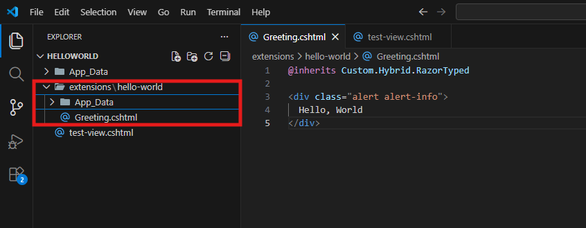
</div>

## Step 2: Test the Extension Locally

### [1. Create a Test Razor View](#tab/create-test-view-file)

Create a test Razor file in your App (not in `/extensions/`).
Render your extension in that file using `@Html.Partial(...)`.

<div gallery="TestExtension">
  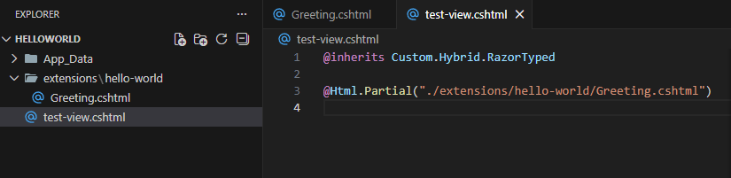
</div>

> [!TIP]
> Keep this test file outside `/extensions/` so it does not become part of your extension package.

### [2. Create a View Definition](#tab/create-test-view-definition)

1. Go to **App Settings**
2. Create a **new view**
3. Assign the test Razor file
4. Set **View doesn't need Data**

<div gallery="View">
  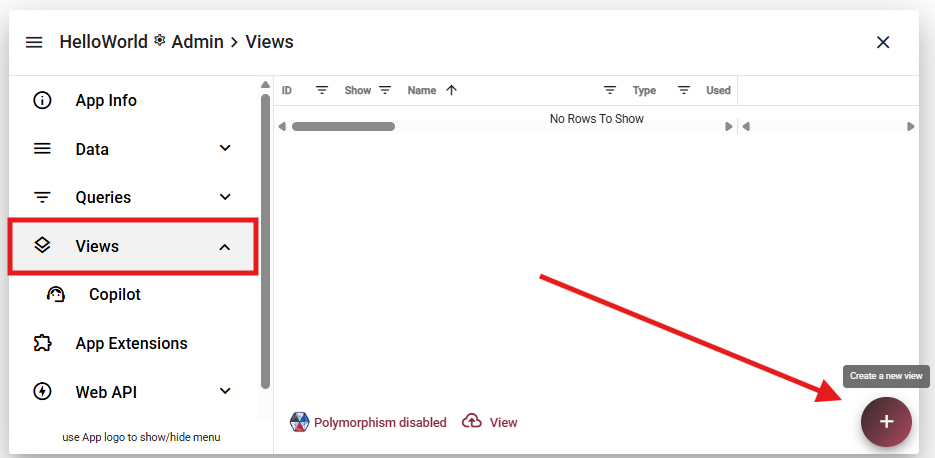
  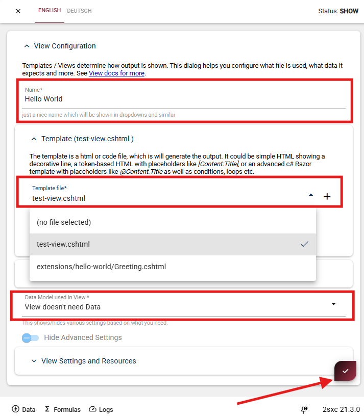
</div>

### [3. Add the View to a Page](#tab/add-test-view-to-page)

Add the app to a page and pick your test view.
You should now see the "Hello, World" output.

<div gallery="AddView">
  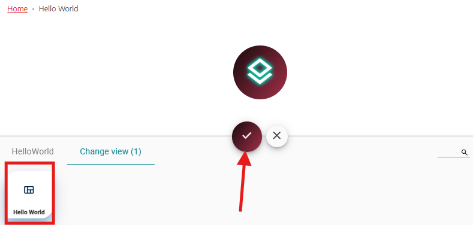
  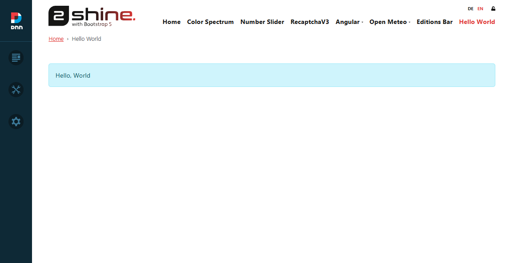
</div>

## Step 3: Configure the Extension

Open **App Settings -> App Extensions**, then edit your extension.

Enable:

- **Has Razor Files**

Save the configuration.

<div gallery="manifest">
  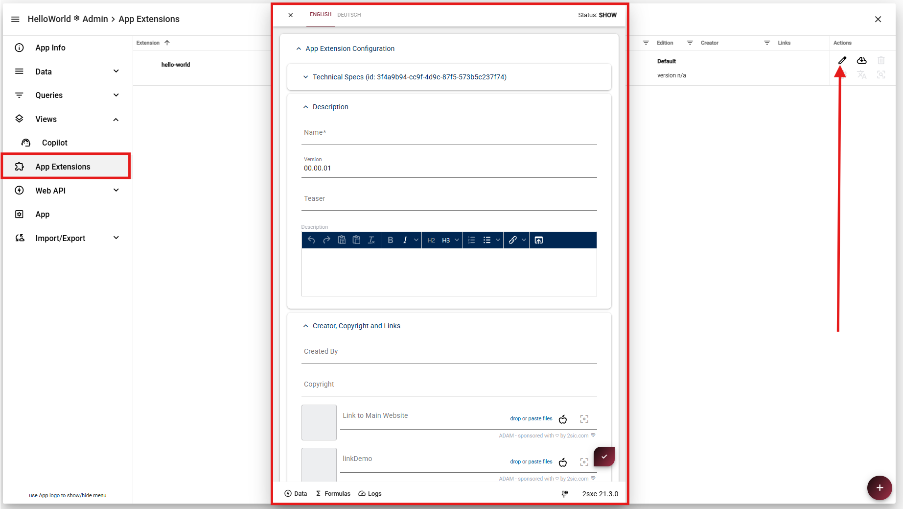
  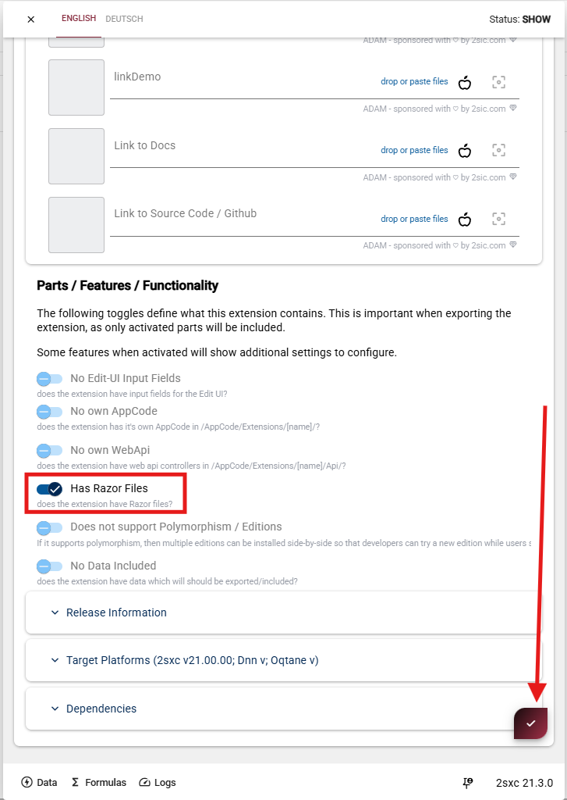
</div>

## Step 4: Export the Extension

In **App Settings -> App Extensions**, click the download icon on your extension.
This creates the extension package.

<div gallery="export">
  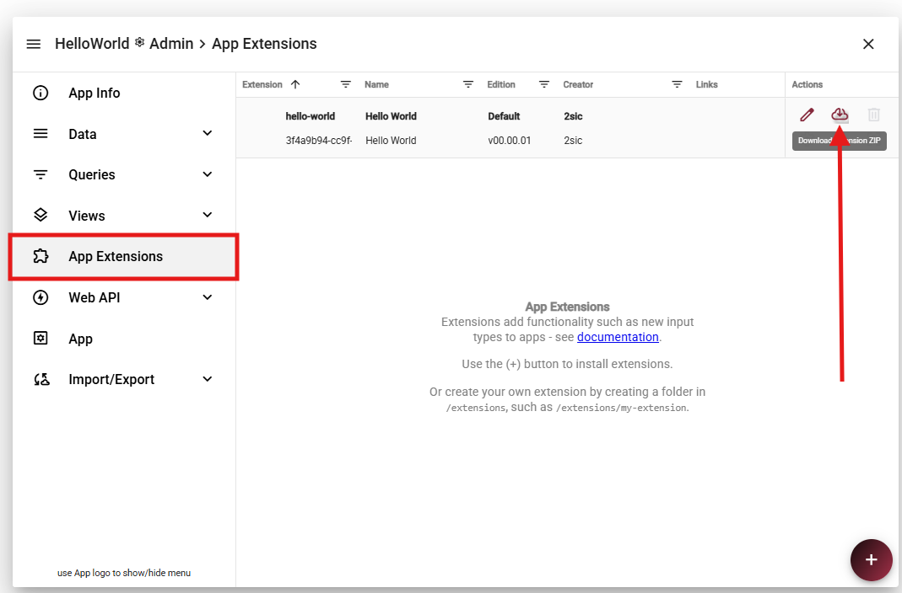
</div>

## Step 5: Import into Another App

### [1. Install the Package](#tab/import-the-extension)

1. Go to **App Settings -> App Extensions** in the target App
2. Click **+**
3. Choose **Select Files**
4. Pick the exported package
5. Click **Install**

<div gallery="import">
  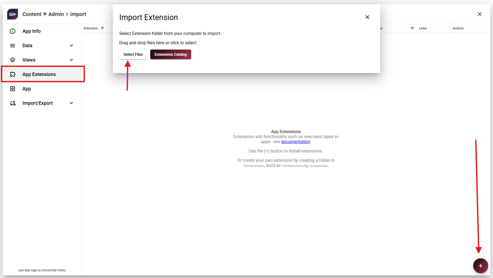
  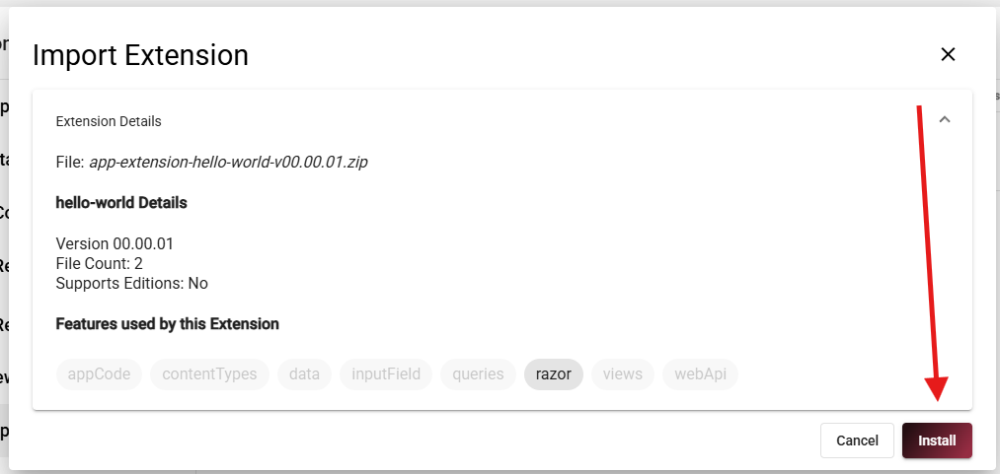
</div>

### [2. Use It in a View](#tab/add-the-extension-to-a-view)

Open any view and render your extension Razor file using `@Html.Partial(...)`.

<div gallery="import">
  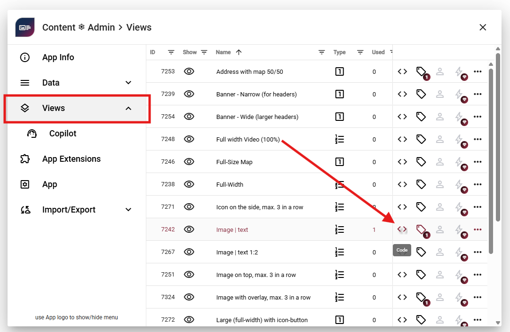
  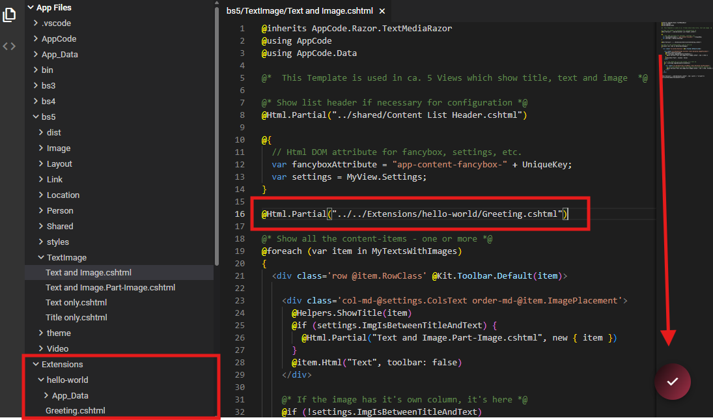
  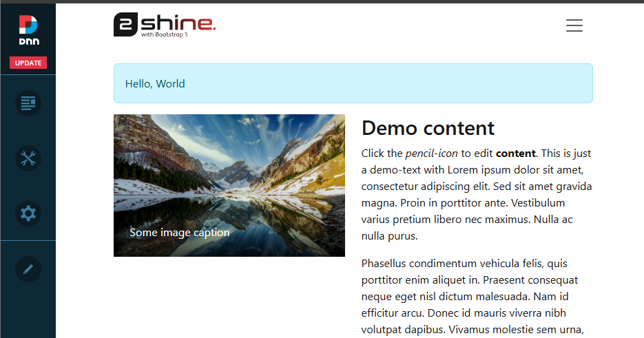
</div>

## Optional: Publish to Marketplace

For production-ready extensions, you can publish packages in the [2sxc Marketplace](https://2sxc.org/en/apps/type/app-extension).

> [!TIP]
> If you want to publish, reach out and we can help with the packaging checklist.

## Recap

You created, tested, configured, exported, and re-imported a working extension.
That is the core workflow for all App Extensions.
