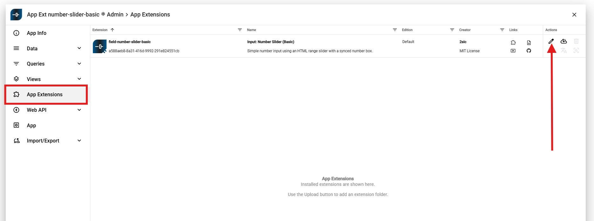

# Input field extension

Custom input fields are **App Extensions** which live inside your App and extend the edit UI.
They are plain JavaScript WebComponents which the 2sxc edit dialog can load and talk to.

This page shows how to create a custom input field in JavaScript using a **basic number slider** as example.

## What are input field extensions?

Input Field Extensions let you **add your own custom input controls**
They are small Components that run inside your App and replace or enhance normal fields like text-boxes or dropdowns.

Use them when you want a field, for example sliders, color pickers, tag selectors, or anything the built-in fields cannot do.

## Folder structure for app extensions

Custom input fields are App Extensions and must be placed in a specific folder:

1. In your App, create a folder called `extensions` (if it does not exist yet)
2. Inside `extensions`, create a folder for your field extension.
    The folder name must follow this pattern:

     ```text
     field-[data-type]-[name]
     ```

    **Examples**
    - `extensions/field-number-dial`
    - `extensions/field-number-slider-basic`
    - `extensions/field-boolean-icons`
    - `extensions/field-string-app-color-picker`

    **Rules**

    - It must start with `field-`
    - The second part is the data type (`string`, `number`...).
    - The last part is a free name that describes your field.
    - no spaces, only dashes `-` as separators.

## Configure your app extension

Before creating a custom input field, you must know where App Extensions live and how to **configure** them inside your App.

This can be found in the App settings on the left sidebar.

TODO: @rb make sure that screenshots show more, otherwise it's hard to figure out where this is from

TODO: @2rb prefer image tags as they can be set to full-width, shadow, etc. - especially important because white-on-white is hard to see
see the last image on this page for an example.

TODO: @2rb probably best to have the instructions first, and then the images as gallery / thumbnails below


To change the settings of your input field extension, click the pen icon next to the extension entry.

TODO: @rb make sure that screenshots show more, otherwise it's hard to figure out where this is from



After opening the editor, you'll see various fields that **describe** and **configure** your extension.

The most important setting is the `Input Fields Configuration`.
This is where you specify which files should be loaded to activate your custom input field extension.


Now that the App Extension is set up, we can start writing the actual code for the input field.

## Example base input field

```javascript
(() => {

  const tagName = "field-example-basic";

  // Minimal HTML for the component
  const html = `<input type="text" />`;

  class BasicField extends HTMLElement {
    connectedCallback() {
      
      // Connecter given by 2sxc
      const connector = this.connector;

      // Getting Settings
      const settings = connector.field?.settings || {};
      
      // Implement the HTML code
      this.innerHTML = html;
      // Listen for user input
      this.onInput = () => {
        this.field?.setValue(this.input.value || null);
      };
      this.input.addEventListener("input", this.onInput);
    }

    disconnectedCallback() {
      // Clean up when component is removed
      this.input.removeEventListener("input", this.onInput);
    }
  }

  customElements.define(tagName, BasicField);
})();
```

The [connector](https://docs.2sxc.org/js-code/custom-fields/connector.html?q=connector)
used in this example is the one provided by 2sxc.

You can find further examples of input field extensions in these repositories:

- [Number Slider](https://github.com/2sxc-apps/app-extension-number-slider-basic)
- [Color Picker](https://github.com/2sxc-apps/app-extension-string-color-picker-spectrum)

## Creating a content type as entity reference

Sometimes you need additional settings for a field which don't belong in the main Content Type itself.  
For this, you create a **separate Content Type** and reference it from the main one.

## How to create and connect a Content Type

To make your custom input field configurable (for example to define `Min`, `Max`, or `Step` for a number slider),
you must create a **separate  Content Type** and **reference it** in your main Content Type.  


[!IMPORTANT] The Content Type name must match your extension name exactly

When creating the settings Content Type, the **Name is extremely important**.

It must be **exactly the same name as your App Extension**,  
**with an `@` in front of it**, **not** the Component tag name.

For example, if your App Extension is named:

`number-slider-basic`

Then your Content Type must be named:

`@number-slider-basic`


If your App Extension and Content Type were set up correctly,  
you can now add a field to your new settings Content Type.

In this example, we add a simple **Number** field called `Step`.

Once this field exists, 2sxc will automatically show it inside the **field configuration UI**
when you use your custom input field in any Content Type.

It should look something like this:


If everything works correctly, you can now rename the Content Type and move it into a new scope.

## Scope

When moving your settings Content Type into a new scope,  
the scope name must follow the **Extensions.{Name of Extension}** pattern.


## Data Bundles

A Data Bundle lets you package your App Extension together with its settings Content Type.


Here you can create a new Data Bundle by clicking the **+** button.  
Give it a name that matches your extension.

## Linking your content type to the data bundle


To add your settings Content Type to the Data Bundle,
simply open the **Data** section of your App Extension and click the **Metadata** icon of the Content Type.  


Then select your Content Type from the list and click **Save**.  
This adds the Content Type to the Data Bundle so it will be included when your extension is exported or imported.


## Adding the data bundle to your extension

TODO: @2rb - this is less ideal


TODO: @2rb this is better


Here you can open your App Extension (using the edit icon) and enable **Includes Data Bundles**.  
Then simply select the Data Bundle you created.  
This links the bundle to your extension,
making sure the settings Content Type is included when the extension is exported or imported.

