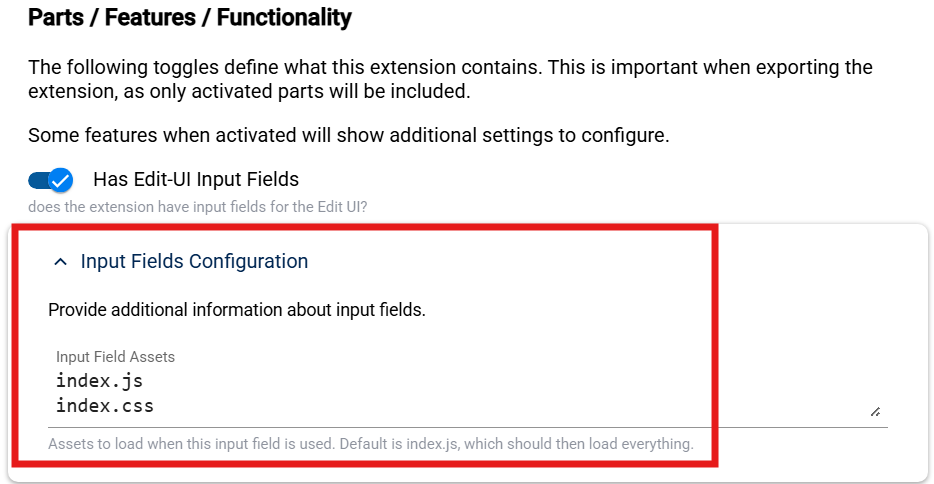
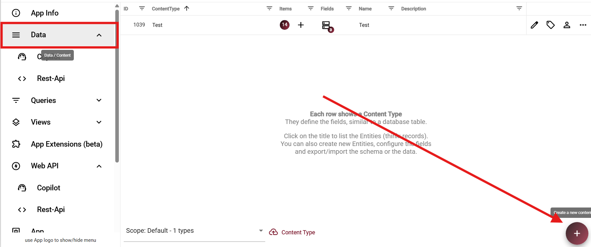
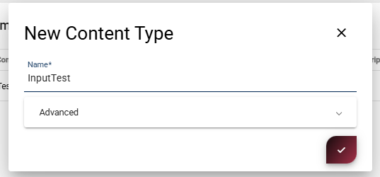
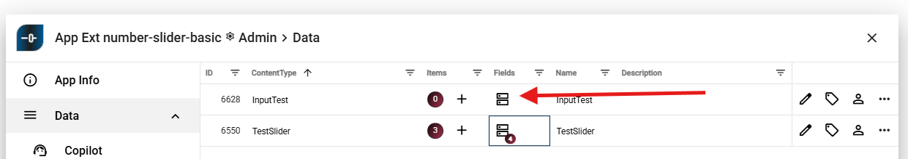
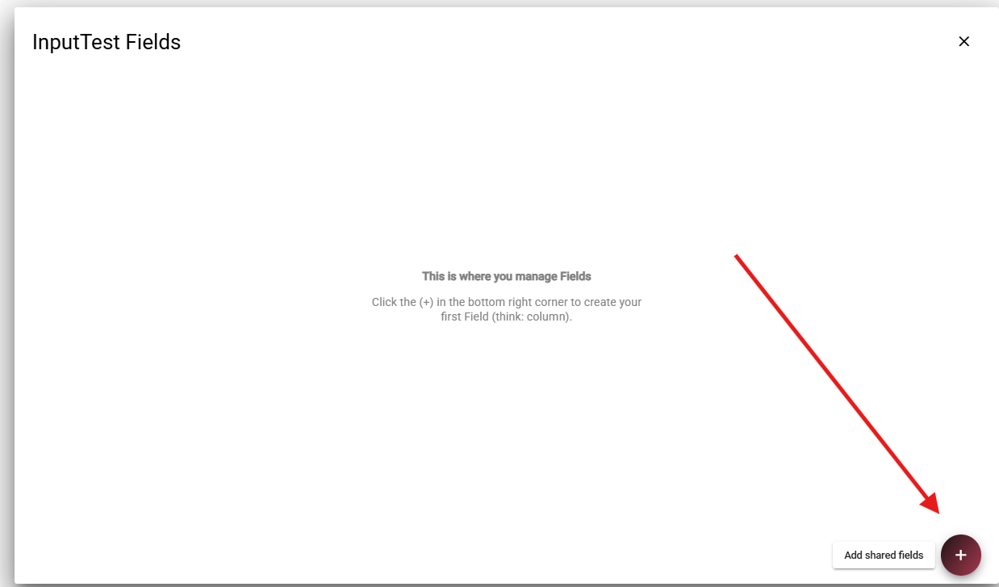
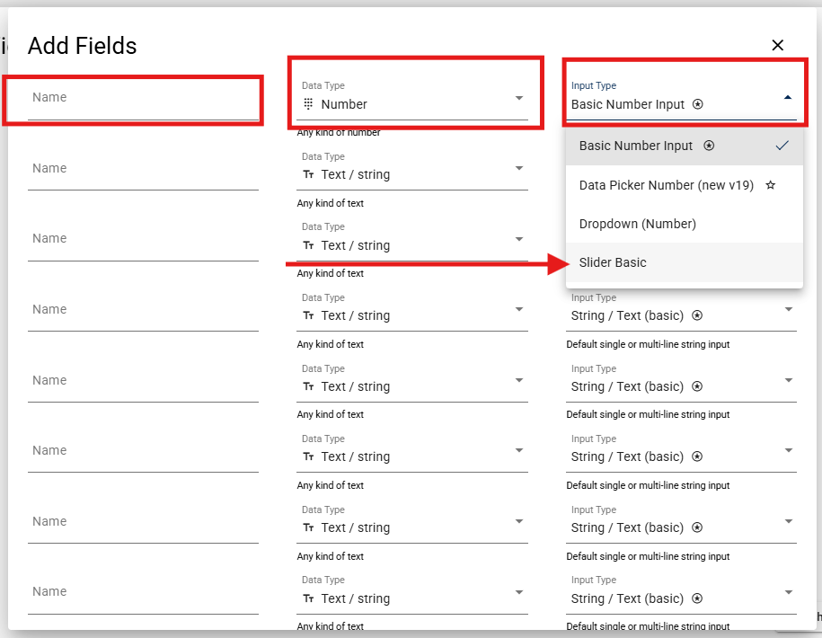
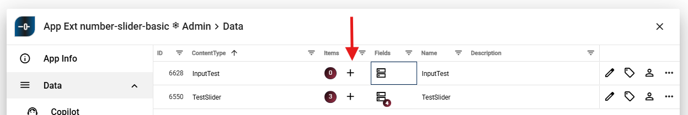
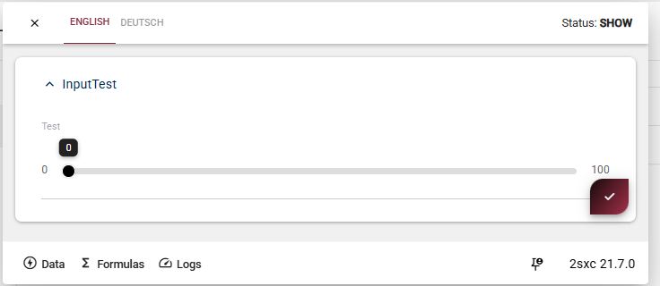
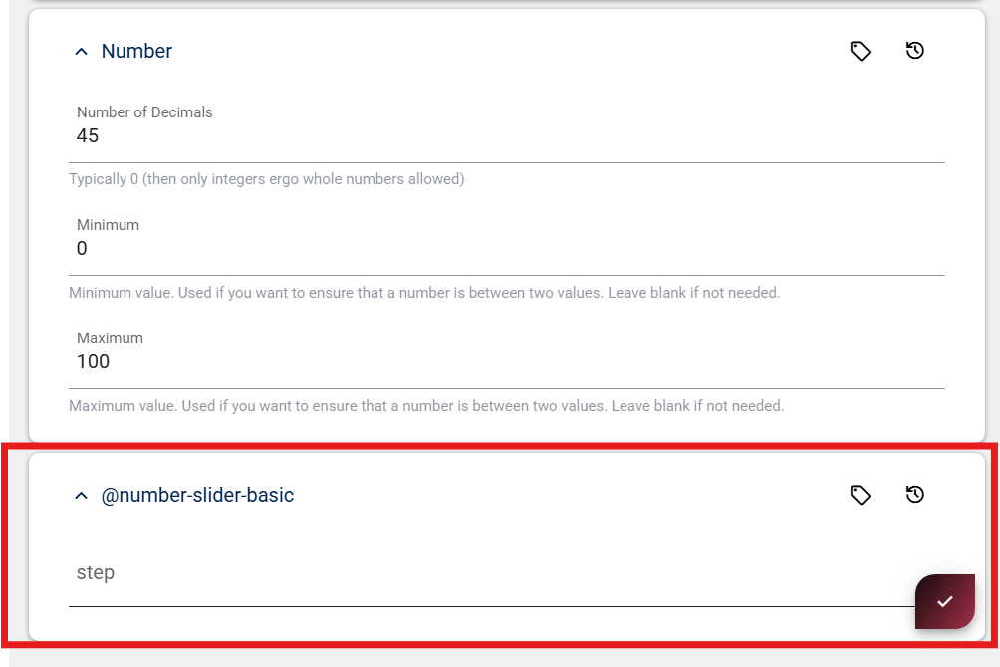

# Input field extension

Custom input fields are **App Extensions** which live inside your App and extend the edit UI.
They are plain JavaScript WebComponents which the 2sxc edit dialog can load and talk to.

This page shows how to create a custom input field in JavaScript using a **basic number slider** as example.

## What are input field extensions?

Input Field Extensions let you **add your own custom input controls**
They are small Components that run inside your App and replace or enhance normal fields like text-boxes or dropdowns.

Use them when you want a field, for example sliders, color pickers, tag selectors, or anything the built-in fields cannot do.

## 1. Folder and Naming

Create the extension in `/extensions/` using this pattern:

```text
field-[data-type]-[name]
```

Examples:

- `extensions/field-number-slider-basic`
- `extensions/field-string-app-color-picker`
- `extensions/field-boolean-icons`

Rules:

- Must start with `field-`
- Second part must be the data type (`string`, `number`, `boolean`, ...)
- Use only lowercase and dashes

## 2. Create the Extension

### 2.1 Create the Code

Write code like this in `index.js`:

```javascript
(() => {

  // This must match the tag name used in the extension definition, and start with "field-"
  const tagName = "field-string-example-basic";

  // Minimal HTML for the component
  const html = `<input type="text" />`;

  class BasicField extends HTMLElement {
    connectedCallback() {
      
      // Connector given by 2sxc
      const connector = this.connector;
      this.field = connector.field;

      // Get field settings
      const settings = connector.field?.settings || {};
      
      // Render input
      this.innerHTML = html;

      this.input = this.querySelector("input");

      // Forward user input back to the 2sxc field API
      this.onInput = () => {
        this.field?.setValue(this.input.value || null);
      };
      this.input.addEventListener("input", this.onInput);
    }

    disconnectedCallback() {
      // Clean up when component is removed
      this.input.removeEventListener("input", this.onInput);
    }
  }

  customElements.define(tagName, BasicField);
})();
```

Some Notes:

- Tag name: `field-number-slider-basic` (must match the extension name)

- The [connector](https://docs.2sxc.org/js-code/custom-fields/connector.html?q=connector) is provided by 2sxc.


### 2.2 Configure the Extension Definition

Open **App Settings -> App Extensions** and edit your extension.
In **Input Fields Configuration**, define which JavaScript files to load - as of now always `index.js`.

<div gallery="gallery-input-field-1">
  
</div>

### 2.3 Examples

You can find further examples of input field extensions in these repositories:

- [Number Slider](https://github.com/2sxc-apps/app-extension-number-slider-basic)
- [Color Picker](https://github.com/2sxc-apps/app-extension-string-color-picker-spectrum)

## 3. Test the Input Field


### [1. Create a Content Type](#tab/create-content-type)

Go to **Data** and click the **+** button to create a new Content Type

Give it a name (e.g. `InputTest`) and save.

<div gallery="gallery-input-field-1">
  
  
</div>

### [2. Open the Fields Editor](#tab/open-fields-editor)

After createn the Content Type:

1. Locate your new Content Type:
2. Click on the **Fields (database icon)**

<div gallery="gallery-input-field-2">
  
</div>

### [3. Add a New Field](#tab/add-new-field)

Click the **+ button** in the bottom right to add a new field.

<div gallery="gallery-input-field-3">
  
</div>

### [4. Configure the Field](#tab/configure-field)

Now configure your field:

- **Name** → e.g. `Test`
- **Data Type** → `Number`
- **Input Type** → `Slider Basic` (your custom input)

<div gallery="gallery-input-field-4">
  
</div>


### [5. Test the Input in the UI](#tab/test-input-ui)

Create or open an item of your Content Type.

You should now see your custom input (e.g. slider) rendered and usable.

<div gallery="gallery-input-field-5">
  
  
</div>

---


## 4. Ready to Export and Import

The extension is now ready to be exported and imported into other Apps,
as described in the [Lifecycle](xref:Extensions.AppExtensions.Create.Lifecycle.Index).

After importing the Extension, you should be able to use this new input field in your app.

## 5a. Add Extension Settings (Optional)

If your field needs settings (for example `Min`, `Max`, `Step`), create a separate settings ContentType.

### [1. Create a Settings ContentType](#tab/create-settings-content-type)

> [!IMPORTANT]
> The settings ContentType name must be `@{extension-name}`.
>
> Example:
>
> - Extension name: `number-slider-basic`
> - Settings ContentType: `@number-slider-basic`

Add fields such as `Step` to this settings type.
2sxc will then show these settings in the field configuration UI.

<div gallery="gallery-content-type-field">
  
  
    
  
  
  
  
</div>

### [2. Access Settings in Code](#tab/access-settings-in-code)

If your input field defines custom settings, 2sxc providesthem on the field connector.

Inside your Component, you can acces them like this.

```js
connectedCallback() {
  const connector = this.connector; // Provided by 2sxc
  this.field = connector.field;     // Metadata about the current field

  // All custom settings from your settings ContentType
  const settings = connector.field?.settings || {};

  // Example: access your custom settings
  const someValue = settings.SomeField;       // e.g. "Label", "Color", etc.
  const anotherValue = settings.AnotherField; // depends on your configuration
}
```

> [!NOTE]
> The available properties depend entirely on you settings ContentType.
> You define the fields, 2sxc just passed them through.

For this to work, your settings ContentType must follow the naming pattern `@{extension-name}`

---

## 5b. Include Settings in Extension Export

If you added content-types to configure the input field, then you must include this in the export.

[!include[](~/shared/extensions/app-extensions/_include-settings-in-export.md)]

---

## History

Created in v21.02
