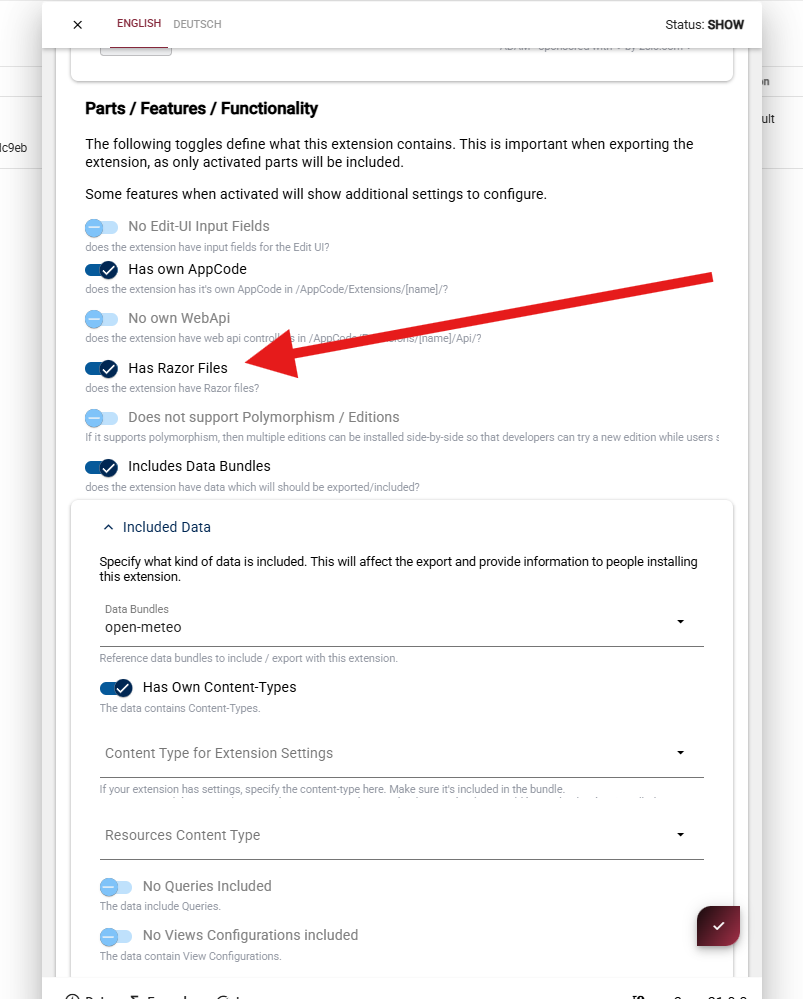

# App Extensions - Razor and Views

<!-- [!include]
 -->

Extensions can include custom Razor Views for re-use.

> [!TIP]
> This allows you to create small libraries of Razor which solve a specific problem,
> and then share them across multiple Apps by installing the extension in each App.

For Razor extensions, you may choose to create one or more of the following:

1. Razor views (`/extensions/{ExtensionName}/{ViewName}.cshtml` files) for rendering content.  
    ...possibly including the view definition, so it's selectable in the template picker.
2. Razor partial views for reusable components.
3. Razor base classes for shared logic, to be used in other Razor files.

## Location and Naming

While developing Razor extensions,
just place them in the `/extensions/{ExtensionName}/` folder of your extension.

You may also choose to place them in a sub-folder like `Views` or `Razor` to keep things organized.

We _suggest_ that you go for a clear naming, such as:

1. Standard views: `/extensions/{ExtensionName}/{ViewName}.cshtml`
1. Partial views: `/extensions/{ExtensionName}/Part {Something}.cshtml`
1. Base classes: `AppCode/Extensions/{ExtensionName}/{Something}Base.cs`

## Packaging & export

> [!IMPORTANT]
> Razor files are only exported if they are specified in the extension configuration.

To include Razor files in an extension:

1. Open the **extension configuration** of the extension

2. Enable **Has View** (but only if you include view definitions)

  
  

## Include in the Package Definition

> [!TIP]
> To include them in the extension, you must ensure that it's part of the package export.

The package export system only exports parts which have been declared to be in use.
So make sure to tick the "Has Query" checkbox in the extension's package definition UI.

If you plan to include view definitions, make sure you also tick the "Has View" checkbox,
and that the view definition is in the data (which must also be exported...)....

...

TODO: @2rb

---

## History

1. Beta in v20.09, to be released in v21.00
