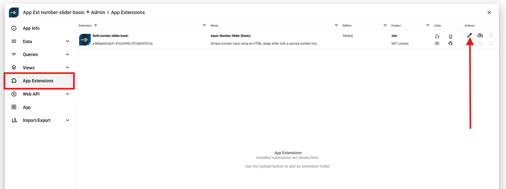
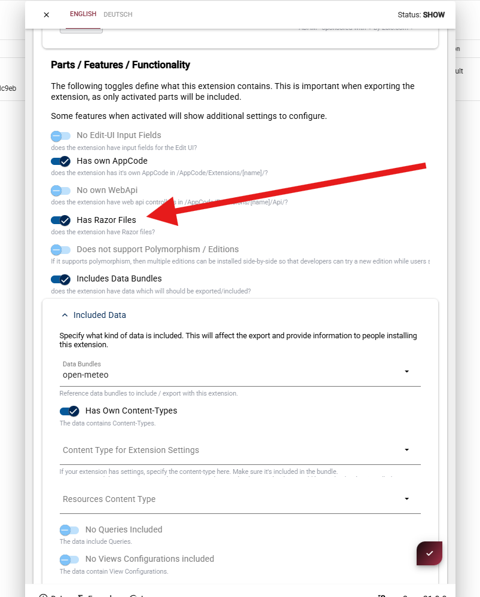

# App Extensions - Razor and Views

Razor extensions let you ship reusable Razor files and optional view definitions.

> [!TIP]
> Use this when you want to reuse presentation components across multiple apps.

## What Can Be Included

1. Razor files in `/extensions/{ExtensionName}/`
2. Partial Razor files for reusable UI blocks
3. Optional view definitions so editors can select these views in the picker
4. Optional base/helper code in AppCode

## Location and Naming

Place Razor files in:

```text
/extensions/{ExtensionName}/
```

Optional organization:

- `/extensions/{ExtensionName}/Views/`
- `/extensions/{ExtensionName}/Partials/`

Suggested naming:

1. Views: `/extensions/{ExtensionName}/{ViewName}.cshtml`
2. Partials: `/extensions/{ExtensionName}/Part{Something}.cshtml`
3. Base classes: `/AppCode/Extensions/{ExtensionName}/{Something}Base.cs`

## Packaging & export

> [!TIP]
> Razor files are exported only if they are declared in the extension configuration.

To include Razor files in an extension:

1. Open extension configuration
2. Enable **Has Razor Files**
3. Save

<div gallery="gallery2">
  
  
</div>

## If You Include View Definitions

> [!TIP]
> View definitions are entity data. They must be included in extension data export settings.

If your extension should ship ready-to-select views:

1. Ensure view entities exist in the app
2. Include them in the extension data/export definition
3. Verify all required dependencies (queries, content types) are included as well

---

## History

1. Beta in v20.09, to be released in v21.00
2. Updated Pictures
