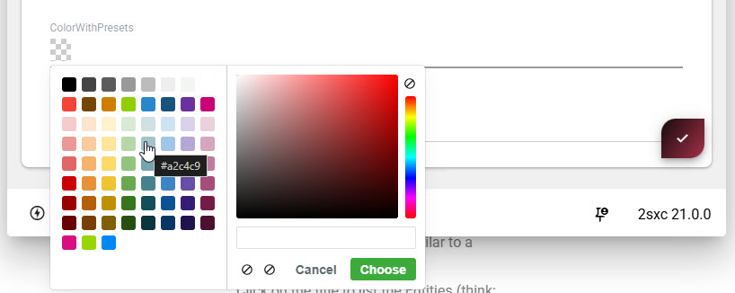

# App Extensions - Overview (new v21 ⭐)

<!-- [!include]
 -->

App Extensions are a powerful way to extend the functionality of your 2sxc Apps.
They allow you to add custom features, tools, and integrations that can enhance the capabilities of your applications.

> [!TIP]
> Think of App Extensions like nuget or npm packages, but specifically designed for 2sxc Apps.
> They can include code, templates, styles, and other resources that can be easily integrated into your App.

<iframe width="560" height="315" src="https://www.youtube.com/embed/pllbgBGsUWA?si=imlg5wQnMwFDfV03" title="YouTube video player" frameborder="0" allow="accelerometer; autoplay; clipboard-write; encrypted-media; gyroscope; picture-in-picture; web-share" referrerpolicy="strict-origin-when-cross-origin" allowfullscreen></iframe>

## Examples

1. **Example: Input Field Extension**  
    An example App Extension is the [Color Picker Spectrum](xref:Extensions.AppExtensions.By2sxc.FieldStringColorPickerSpectrum.Index) extension.
    This extension adds a custom input field that allows users to select colors.
    Once installed, it can be used in any App to provide a rich color selection experience on a string-input field like this:

2. **Example: Admin Tools Extension**  
    Another example is an Admin Tools extension [Radmin](xref:Extensions.AppExtensions.By2sxc.Radmin.Index) which lets you quickly create admin tables of data to manage:

3. **Example: DataSource Extension**  
    A DataSource extension like [Open Meteo](xref:Extensions.AppExtensions.By2sxc.OpenMeteo.Index) allows you to fetch weather data from the Open Meteo API and use it within your App's queries.

  
  

---

## Key Features of App Extensions

1. **Isolated**: App extensions are in a special folder, so they don't interfere with the main App code.
2. **Manageable**: Easily install, update, and remove App extensions.
3. **Shareable**: App extensions can be exported and shared with others, making it easy to reuse.
4. **Versioned**: Many apps can have the same extension in its own version.
5. **Configurable**: Many App extensions come with settings that allow you to customize their behavior.
6. **Polymorphic**: App extensions can be installed in multiple editions, allowing you to test a new edition while keeping the stable one active.

## Getting Started with App Extensions

To start using App extensions, follow these steps:

1. **Access the App Extensions Interface**: Navigate to the App management section in your 2sxc installation and select the App you want to extend.
2. [Browse Available Extensions](https://2sxc.org/en/apps/type/app-extension) in the App Catalog.
3. [Install an Extension](xref:Extensions.AppExtensions.Install.Index): Select an extension you want to install and follow the prompts to add it to your App.

> [!TIP]
> For a first experience, we recommend you try the
> [Color Picker Spectrum](xref:Extensions.AppExtensions.By2sxc.FieldStringColorPickerSpectrum.Index) extension,
> which adds a color selection tool to your Apps.

## Types of App Extensions

App extensions can come in various types - and they can combine all the types, including:

- [Input Types](xref:Extensions.AppExtensions.Create.InputField.Index): Custom input fields for data entry.
- [App Code and Web APIs](xref:Extensions.AppExtensions.Create.AppCode.Index): Custom C# code and Web APIs to add server-side functionality.
- [Visual Queries](xref:Extensions.AppExtensions.Create.VisualQuery.Index): Predefined queries that can be reused across different parts of your App
- [Templates / Views](xref:Extensions.AppExtensions.Create.RazorAndViews.Index): Custom templates for rendering content.
- **Scripts**: JavaScript or server-side scripts that add functionality.
- **Styles**: CSS styles that can be applied to your App's appearance.
- **Tools**: Utilities that enhance the App development experience.
- [DataSources](xref:Extensions.AppExtensions.Create.AppCode.DataSources): Custom data sources for retrieving and manipulating data.

## Developing Your First App Extension

➡️ For first steps, let's create a [simple Hello-World extension](xref:Extensions.AppExtensions.Create.HelloWorld.Index).

---

## History

1. Introduced in 2sxc v21

Shortlink: <https://go.2sxc.org/app-ext>
