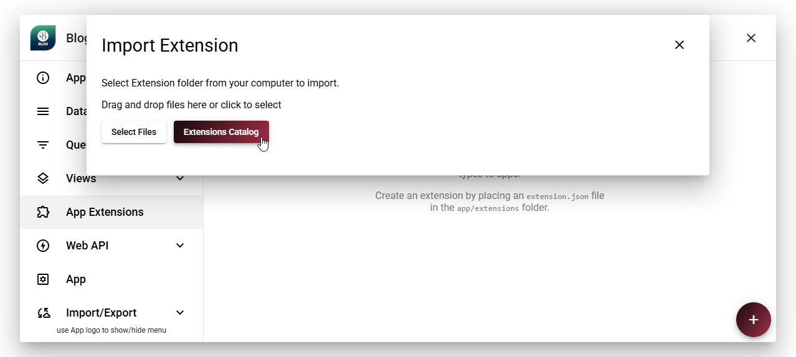
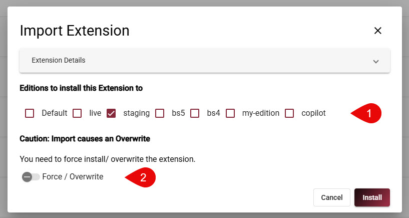

# How to Install App Extensions

<!-- [!include]
 -->

App Extensions can be installed quickly and easily - and also removed again if needed.

There are two ways to install App Extensions:

1. **From the 2sxc App Store**:
    Many App Extensions are available in the 2sxc [App Store](https://2sxc.org/en/apps/type/app-extension).
    You can browse the store, find the extension you want, and install it directly into your App with just a few clicks.
2. **Manual Installation**: If you have an App Extension package (usually a .zip file), you can manually upload and install it into your App through the 2sxc interface.

Here's a short video demonstrating installation and upgrades of App Extensions:

<iframe width="560" height="315" src="https://www.youtube.com/embed/pllbgBGsUWA?si=imlg5wQnMwFDfV03" title="YouTube video player" frameborder="0" allow="accelerometer; autoplay; clipboard-write; encrypted-media; gyroscope; picture-in-picture; web-share" referrerpolicy="strict-origin-when-cross-origin" allowfullscreen></iframe>

## [Install from the 2sxc App Store](#tab/install-store)

To install an App Extension from the 2sxc [App Store](https://2sxc.org/en/apps/type/app-extension), follow these steps:

1. Go to the **App Settings** of the App where you want to install the extension.
2. Navigate to the **App Extensions** and click **Add Extension**.
3. Choose **Extensions Catalog** and select your extension from the list.
4. Click **Install** to add the extension to your App.

When you're about to install the app, the system will do a _preflight_ to check for any potential issues.
If everything looks good, the installation will proceed.

  
  
  
  
  

> [!NOTE]
> Note that many Extensions can be installed in multiple editions,
> allowing you to test a new edition while keeping the stable one active.
> This is explained more below.

## [Manual Installation](#tab/install-manual)

To manually install an App Extension, do the same as before, but instead of choosing from the catalog,
select the option to upload a package, then choose your .zip file and follow the prompts to complete the installation.

---

## Post-Installation Steps

Every extension is different and offers different features.
Some extensions will work immediately after installation, while others may require additional configuration.

## Installing Multiple Editions of an Extension (Polymorphic Extensions)

Some App Extensions are polymorphic, meaning they can be installed in multiple editions.
This allows you to test a new edition of an extension while keeping the stable one active.

This shows you how the install experience adds the editions selection,
and also allows you to force-install if the specific extension was already installed in the same edition (overwrite).

> [!TIP]
> Polymorphic editions are just simple folders in your App.
> For 2sxc to differentiate which folders are editions and which ones are just normal folders,
> you need to create the `app.json` configuration in your Apps root `App_Data` folder.
>
> See  for more information on how to set this up.

When installing a polymorphic extension, you will be prompted to select the edition you want to install.
You can install to multiple editions in the same go.

> [!IMPORTANT]
> 2sxc Polymorphism is powerful, but there are limitations.
> If an extension contains data schemas or data entities,
> these will only be loaded from the primary edition, since the data model cannot be polymorphic.

---

## History

* App Extensions introduced in v21
