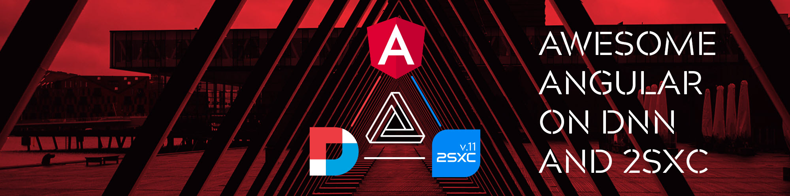

# Using Angular in 2sxc / Dnn

[!include]

[Angular](https://angular.io/) is an awesome JavaScript framework to build applications, especially SPA style applications. 

We've created a full solution for integrating Angular with Dnn and 2sxc and it's documented here. 
The core parts are: 

* [Integrate Angular in Dnn](xref:JsCode.Angular.IntegrateAngularRuntime){title="icon:box"}
  Setup Angular integration for runtime or development

* [Integrate Dnn into Angular](xref:JsCode.Angular.DnnSxcAngular.Install){title="icon:plug"}
  Connect Dnn APIs and services inside Angular

* [Integrate 2sxc and CMS features into Angular](xref:JsCode.Angular.DnnSxcAngular.Index){title="icon:gear"}
  Use 2sxc and CMS functionality inside Angular apps
  
## Introduction Video

<iframe width="100%" height="400px" src="https://www.youtube.com/embed/I4trJvuSSIM" frameborder="0" allow="accelerometer; autoplay; clipboard-write; encrypted-media; gyroscope; picture-in-picture" allowfullscreen></iframe>

## Get Started

1. Discover the [Template Angular App](xref:JsCode.Angular.TemplateApp) to first experiment with it
1. Then either just modify the Template App to make it into anything you want
1. Or create an own solution using the parts you like
