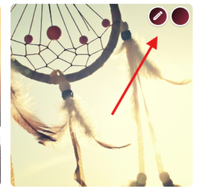
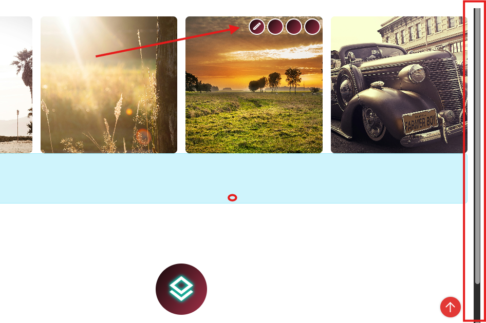
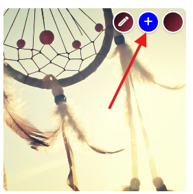

# Toolbar Settings Enhanced Guide with Examples & Screenshots

[!include[](~/pages/basics/stack/_shared-float-summary.md)]
<style>.context-box-summary .edit-custom { visibility: visible; }</style>

Toolbars in 2sxc are incredibly powerful, and **Toolbar Settings** let you fully control how they behave, where they appear, and how users interact with them.

---

# What Toolbar Settings Do

Each toolbar placed inside the page can have custom settings to control **visibility**, **hover behavior**, **floating behavior**, and **styling**.

👉 If you are new to toolbars, start with the tutorial:  
**[Toolbar Basics](xref:Tut.Toolbar)**

# ⚙️ Available Settings (with explanations)

| Setting | Values | Description | Screenshot |
|--------|--------|-------------|------------|
| **autoAddMore** | `start` \| `end` | Adds a “…” button if too many groups exist. Default: `end`. |  |
| **hover** | `right` (default) \| `left` \| `none` | Where the toolbar appears when hovering over the element. |  |
| **follow** | `none` (default) \| `initial` \| `scroll` \| `always` | Keeps the toolbar visible even when its element is scrolled out of view. It does *not* follow the mouse. |  |
| **show** | `hover` (default) \| `always` | Whether the toolbar is always visible or only when hovering over the element. |  |
| **classes** | string | Additional CSS classes to style your toolbar |  |

---

# Example
```html
<div id="my-table"></div>
<script>
  const tableEl = document.querySelector("#my-table");
  const sxc = $2sxc(tableEl);

  // Only render toolbars in edit mode
  if (!sxc.isEditMode()) return;

  // Define toolbar buttons
  const actions = [
    { action: "edit", entityId: 27, classes: "blue" },  
    { action: "delete", entityId: 27 }
  ];

  // Toolbar settings (hover, follow, etc.)
  const settings = {
    hover: "left",
    follow: "scroll",
    autoAddMore: "end",
    show: "always",
    classes: "toolbar-blue"
  };

  // Build and render toolbar
  const toolbarHtml = sxc.manage.getToolbar({ items: actions, settings });

  const wrapper = document.createElement("div");
  wrapper.innerHTML = toolbarHtml;
  document.body.appendChild(wrapper);
</script>
```

# Old Syntax (Deprecated)

```html
<div class="sc-element">
  <ul class="sc-menu" data-toolbar=''
      settings='{ "hover": "left", "align": "left" }'></ul>
</div>
```

Do not use this anymore 

---

# More Resources

- **[Toolbar Tutorials](xref:Tut.Toolbar)**
- Legacy blog (for historical context): <http://2sxc.org/en/blog/post/customize-edit-toolbar-hover-alignment-more-button-look-and-feel>

---

# History

- Introduced in **2sxc 8.06**
- `follow` added in **11.06**
