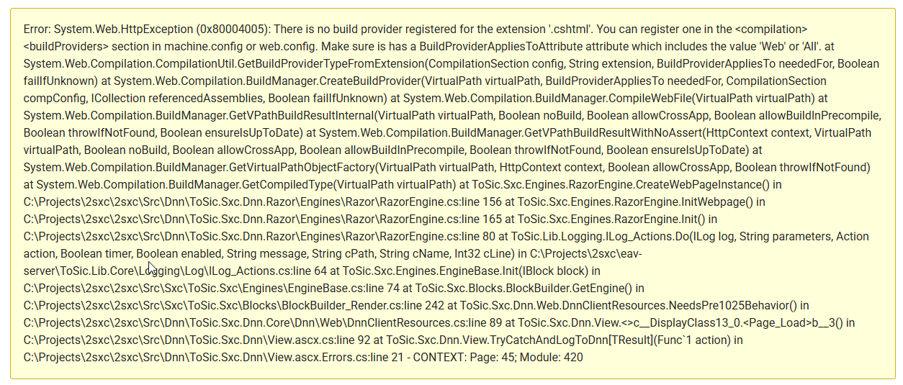

# Fix rare Dnn Error: "There is no build provider registered for the extension 'cshtml'"

In rare cases you may suddenly see this error in Dnn:




```text
Error: System.Web.HttpException (0x80004005): There is no build provider registered for the extension '.cshtml'. You can register one in the <compilation><buildProviders> section in machine.config or web.config. Make sure is has a BuildProviderAppliesToAttribute attribute which includes the value 'Web' or 'All'. at System.Web.Compilation.CompilationUtil.GetBuildProviderTypeFromExtension(CompilationSection config, String extension, BuildProviderAppliesTo neededFor, Boolean failIfUnknown) at System.Web.Compilation.BuildManager.CreateBuildProvider(VirtualPath virtualPath, BuildProviderAppliesTo neededFor, CompilationSection compConfig, ICollection referencedAssemblies, Boolean failIfUnknown) at System.Web.Compilation.BuildManager.CompileWebFile(VirtualPath virtualPath) at System.Web.Compilation.BuildManager.GetVPathBuildResultInternal(VirtualPath virtualPath, Boolean noBuild, Boolean allowCrossApp, Boolean allowBuildInPrecompile, Boolean throwIfNotFound, Boolean ensureIsUpToDate) at System.Web.Compilation.BuildManager.GetVPathBuildResultWithNoAssert(HttpContext context, VirtualPath virtualPath, Boolean noBuild, Boolean allowCrossApp, Boolean allowBuildInPrecompile, Boolean throwIfNotFound, Boolean ensureIsUpToDate) at System.Web.Compilation.BuildManager.GetVirtualPathObjectFactory(VirtualPath virtualPath, HttpContext context, Boolean allowCrossApp, Boolean throwIfNotFound) at System.Web.Compilation.BuildManager.GetCompiledType(VirtualPath virtualPath) at ToSic.Sxc.Engines.RazorEngine.CreateWebPageInstance() in C:\Projects\2sxc\2sxc\Src\Dnn\ToSic.Sxc.Dnn.Razor\Engines\Razor\RazorEngine.cs:line 156 at ToSic.Sxc.Engines.RazorEngine.InitWebpage() in C:\Projects\2sxc\2sxc\Src\Dnn\ToSic.Sxc.Dnn.Razor\Engines\Razor\RazorEngine.cs:line 165 at ToSic.Sxc.Engines.RazorEngine.Init() in C:\Projects\2sxc\2sxc\Src\Dnn\ToSic.Sxc.Dnn.Razor\Engines\Razor\RazorEngine.cs:line 80 at ToSic.Lib.Logging.ILog_Actions.Do(ILog log, String parameters, Action action, Boolean timer, Boolean enabled, String message, String cPath, String cName, Int32 cLine) in C:\Projects\2sxc\eav-server\ToSic.Lib.Core\Logging\Log\ILog_Actions.cs:line 64 at ToSic.Sxc.Engines.EngineBase.Init(IBlock block) in C:\Projects\2sxc\2sxc\Src\Sxc\ToSic.Sxc\Engines\EngineBase.cs:line 74 at ToSic.Sxc.Blocks.BlockBuilder.GetEngine() in C:\Projects\2sxc\2sxc\Src\Sxc\ToSic.Sxc\Blocks\BlockBuilder_Render.cs:line 242 at ToSic.Sxc.Dnn.Web.DnnClientResources.NeedsPre1025Behavior() in C:\Projects\2sxc\2sxc\Src\Dnn\ToSic.Sxc.Dnn.Core\Dnn\Web\DnnClientResources.cs:line 89 at ToSic.Sxc.Dnn.View.<>c__DisplayClass13_0.<Page_Load>b__3() in C:\Projects\2sxc\2sxc\Src\Dnn\ToSic.Sxc.Dnn\View.ascx.cs:line 92 at ToSic.Sxc.Dnn.View.TryCatchAndLogToDnn[TResult](Func`1 action) in C:\Projects\2sxc\2sxc\Src\Dnn\ToSic.Sxc.Dnn\View.ascx.Errors.cs:line 21 - CONTEXT: Page: 45; Module: 420
```

## Why This Happens

It seems that in rare circumstances there are internal mismatches between cached DLLs in the global assembly cache (GAC) and the Dnn build provider.
We're not sure why this happens, but we assume it has something to do with server updates making the cached DLLs invalid.

## How to Fix This

The solution is to clear the IIS DLL cache for this site.
It is located in the `C:\Windows\Microsoft.NET\Framework64\v4.0.30319\Temporary ASP.NET Files` folder.

But instead of manually deleting the files, we recommend you change the web.config file of your Dnn site to force a rebuild of the DLLs.

To do this, modify the following line in your web.config file:

```xml
<compilation debug="false" strict="false" targetFramework="4.7.2">
```

to

```xml
<compilation debug="true" strict="false" targetFramework="4.7.2">
```

This will force Dnn to rebuild the cached DLLs, which should resolve the issue.

After making this change, you should revert the `debug` attribute back to `false` for production environments.
